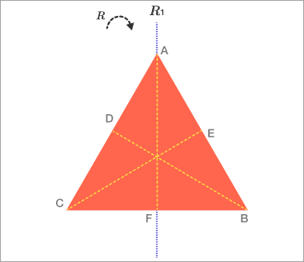

A [rigid transformation](../terms/rigid-transformation.md) of an equilateral triangle maps the triangle back to itself. Here’s what that means, intuitively: imagine that the triangle is made of rigid plastic, and you put it on a piece of paper and draw its outline with a pen. A rigid transformation is a way of picking the triangle up, moving it around without bending or tearing it, and putting it back down so that it fits inside the outline you drew.

One such transformation is rotating the triangle clockwise by 
240∘, which we consider equivalent to rotating the triangle counterclockwise by 120&deg;, since both leave the vertices of the triangle in identical positions. Another is reflecting the triangle about a line. It's also easy to forget the transformation defined by not changing the position of the triangle's vertices at all, which we will call the identity transformation.

What is the connection with symmetry? Well, when you casually say a shape has symmetry, like the capital letter A, that just means there’s a rigid transformation, horizontal reflection, that sends A to itself. The letter H has at least one more symmetry, because now there is another rigid transformation that sends it to itself, vertical reflection. We will define a symmetry of an object to be a rigid transformation from that object to itself.

So, from the last problem, we will say an equilateral triangle has six symmetries: three rotations and three reflections.

Two more points: Since symmetries are rigid transformations, they are really functions. We only care about where the points end up, not how they got there. In the example of the triangle, rotating clockwise by 120&deg; is considered the same symmetry as rotating clockwise by 480&deg;(i.e. 360&deg;+120&deg;), and the same symmetry as rotating counter-clockwise by 240&deg;.

Also, we will always count the “identity symmetry,” corresponding to picking up the triangle, not changing it, and putting it right back down. This corresponds to the identity rigid transformation $f(x) = x$

square has 8 symmetries

Group theory is an area of algebra, which means that we will be studying how combining objects can make new objects. That’s what started to happen in the last problem, when we combined symmetries with themselves. To use notation we will explore in the next lesson, the correct answer to that problem (C) can be rephrased as follows: Only the hexagon has a symmetry $S$ with the property that $S^1 \neq I,S^2\neq I, S^3\neq I,s^5\neq I,S^6=I$ where $I$ is the identity transformation.
<!-- 
\(S_2 \neq I\)

\(S_3 \neq I\)

\(S_4 \neq I\)

\(S_5 \neq I\)

\(S_6 = I\) $ -->