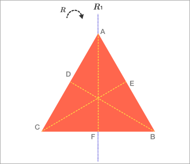
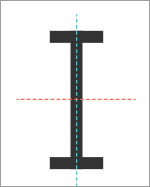

# Combining symmetries

In fact, we can combine any two symmetries of a shape by doing one after the other, and obtain a third symmetry of the shape. We express this with the following notation: If A and B are symmetries of a shape, $A*B$, or sometimes just $AB$ or , $A∘B$, denotes the symmetry you get by applying $B$ first, and then $A$. We will call this new symmetry theproduct of $A$ and $B$.
if we let $\phi_1 $ denote the reflection about AF , let $\phi_2$ denote the reflectrion $CE$ and let $R$ denote clockwise rotation by 120&deg; then we can write equation $\phi_2*\phi_1 = R$

To really understand the symmetries of an object, we should know not only how many symmetries there are, but what the rules are for how they combine with each other.
For the equilateral triangle, we could make a 6x6 “multiplication table” that tells you, for any two of the six symmetries of the triangle, what their product is. In the next problems, we will do exactly that for a slightly simpler object.

The letter I has four symmetries:

* A horizontal reflection (flipping across the blue line) $H$
* A vertical reflection (flipping across the red line) $V$
* A rotation by 180&deg; $R$
* The identity transformation $I$

4x4 multiplication table for this object.

|           |  $I$  |  $H$  |  $V$  |  $R$  |
| :---:     | :---: | :---: | :---: | :---: |
|  $I$      |  $I$  |  $H$  |  $V$  |  $R$  |
|  **$H$**  |  $H$  |  $I$  |  $R$  |  $V$  |
|  **$V$**  |  $V$  |  $R$  |  $I$  |  $H$  |
|  **$R$**  |  $R$  |  $V$  |  $H$  |  $I$  |

This table, once it’s filled out, will be used to read off the product of symmetries.

For instance, $H∗V$ will appear in the row labeled $H$ and the column labeled , $V$, although that entry hasn’t been filled out yet. We filled out the diagonals with $I$ because we saw in the last problem that ,$H∗H$, $V∗V$ and $R∗R$ are all $I$.

The first row has products like $I∗H$ and , $I∗V$, which result from doing a transformation like $H$ or $V$ and then doing the identity.A product like $I∗H$ means to do $H$ first. The first column are products resulting from doing the identity first, and then some other transformation.

example with numbers and $\mod 2$
|   | 0 | 1 |
|:-:|:-:|:-:|
| 0 | 0 | 1 |
| 1 | 1 | 0 |

Now, let’s do the same thing to ordered pairs of 0’s and 1’s, like (0,1) and (1,0). How do you add two such pairs? Just add the x-coordinates and y-coordinates separately. For example:
(0,1)+(1,0)=(1,1)
(1,1)+(1,1)=(0,0)
​
|           |  $(0,0)$  |  $(1,0)$  |  $(0,1)$  |  $(1,1)$  |
| :--------:| :-------: | :-------: | :-------: | :-------: |
|  $(0,0)$  |  $(0,0)$  |  $(1,0)$  |  $(0,1)$  |  $(1,1)$  |
|  $(1,0)$  |  $(1,0)$  |  $(0,0)$  |  $(1,1)$  |  $(0,1)$  |
|  $(0,1)$  |  $(0,1)$  |  $(1,1)$  |  $(0,0)$  |  $(1,0)$  |
|  $(1,1)$  |  $(1,1)$  |  $(0,1)$  |  $(1,0)$  |  $(0,0)$  |

This particular table will be represented by something called the [Klein four-group](../terms/klein-four.md). We will encounter it again, along with many other interesting examples.