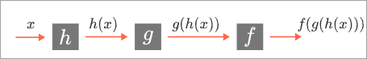
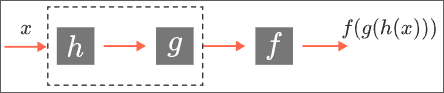
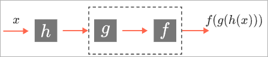

# Group axioms

The set of its symmetries forms an algebraic object, meaning that there is a kind of “multiplication”: Given two symmetries.

$S$ and $T$, their product $ST$ is the transformation you get by applying $T$ first, and then.
$S$. This corresponds to taking the composition of the transformations $S$ and $T$.
Let’s look at some of the properties these algebraic systems always have, and we’ll use these properties to motivate our definition of a group.

## Identity

Every collection of symmetries has the identity symmetry $I$, given by the function $f(x)=x$, that “does nothing.” So what happens when you multiply $I$ by the other symmetries?

## Inverses

Because the underlying functions are all [bijections](../terms/bijection.md), they all have inverses. Intuitively, this means that given any symmetry $S$ of a shape, there is a symmetry, called the inverse of ,
$S$, that “undoes” $S$.

For example, with the equilateral triangle, if $S$ is clockwise rotation by 120&deg;, then the inverse of $S$ is counterclockwise rotation by 120&deg; . Suppose $T$ is a reflection symmetry of the equilateral triangle.

## Commutativity

One nice property that some algebraic systems have is commutativity. This means that when you perform the operation, the order of the two arguments doesn’t matter.

For example, for any two real numbers $x$ and $y$, $x*y=y*x$. Real number multiplication is commutative, and real number addition is also commutative.
 
## Associativity
The associative property in the case of real numbers says that given real numbers $x,z,y | (x*y)*z= z*(y*z)$
“multiplication” here is just function composition, and composition is always associative. The reason why is a mathematical argument that’s so simple it’s a little tricky, and we'll explore it next.

we have three functions $f,g,h$ which we are going to compose together in the order shown below. So we take an input $x$ on the left, and feed it all the way through the system: first we feed it to $h$, then we we feed the result of $h(x)$ to $g$, and then we feed that result $g(h(x))$ to $f$, yielding $f(g(h(x)))$, or $(f \circ g) \circ h$, at the end.

To show associativity,let's compare $(f\circ g) \circ h$ with $f \circ (g \circ h)$. But $f \circ (g \circ h)$ is the function you get by first doing $g \circ h$, and then doing $f$; in other words, by “grouping together” the leftmost two functions into a single box

On the other hand, $(f\circ g)\circ h$ is the function you get by first doing $h$ and then doing $f\circ g$; in other words, by “grouping together” the rightmost two functions into a single function box:

But putting additional boxes around functions doesn’t change the assembly line: in both cases, we take an input $x$ and feed it into $h$, then the result of that into $g$, and then the result of that into $f$, producing $f(g(h(x)))$. Hence $(f\circ g)\circ h$ and $f\circ(g\circ h)$ are the same function, and we’ve proven associativity of function composition.

We have finally come to the idea of the group: an abstract object with a “multiplication operation” defined, that satisfies the three axioms.

The symmetries we have been looking at are examples of groups, but there are a lot more interesting examples to come, some of them fun and some of them strange. You will see what powerful insight you get by standing on the mountaintop.

